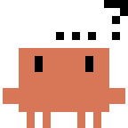

# bt's Blog

English · [简体中文](./README.md)

A personal homepage + arcade built on [Astro](https://astro.build) — hard-edge paper design (dark-first) + a self-hosted micro-timeline.

## ✨ Features

### Design
- **Hard-edge paper design** — cards/buttons/inputs are all square-cornered + monospace uppercase micro-labels + dotted dividers. Dark is the default (paper `#0e0e13` + electric blue `#6e6eff`); light is the inverse (`#fdfdfd` + `#0000f2`)
- **💡 Dark/light theme toggle** — one click on the bulb in the top bar, **dark by default** (the first visit is always dark, not system-driven), persisted in localStorage; shared with the arcade
- **Particle background** — a site-wide `bg-particle` canvas mounted in `Base.astro`, shown in dark mode; Mome embeds the same asset via an iframe
- **Local fonts** — Oswald (narrow display) + Courier Prime (mono), self-hosted under `/fonts/`, no Google Fonts dependency, instant loading in mainland China
- **Responsive layout** — desktop: fixed left sidebar + top nav; mobile: fullscreen overlay menu with hairline hamburger animation

### Content
- **MDX support** — embed JSX components in articles, full Markdown syntax
- **LaTeX math** — KaTeX rendering, inline `$...$` and block `$$...$$`
- **Code highlighting** — Expressive Code, `github-dark` / `github-light` dual themes

### 🎮 Arcade (/games/)
All open source, purely static and self-hosted, playable on mobile and desktop:

| Game | Type | Mobile |
|------|------|--------|
| Airplane War | Bullet hell | ✅ Native touch |
| Big Eats Small | agar.io single-player | ✅ Touch patch |
| Suika Game | Suika gameplay | ✅ Mobile-first |
| Transport Ship · CF 3D | FPS map | ✅ Touch (desktop best) |
| Pelican on a Bike | 3D casual | ✅ Touch |
| Speed Drift 3D · QQ Speed fan | 3D racing | ✅ Touch (desktop best) |
| Pixel Monster Battle | Pixel RPG | ✅ |
| Celeste | Platformer (web port) | 🖥 Desktop; mobile via the PICO-8 external link |
| Mini Games ×124 | Collection (external) | ✅ |
| Destroy this site | Destruction sandbox (real page) | ✅ Mobile has a joystick + fire button |
| clawd ball | Eraser (real page) | ✅ Mobile has a virtual joystick |

Adding a game: drop the static files into `public/games/<name>/` and add a card in `public/games/index.html`.

#### 🧨 The two that use our own homepage as a level

These two don't ship new levels — **they turn the blog homepage (real DOM) into the game world**, with a same-origin iframe stretched to the full page height and the camera following the character:

- **[Destroy this site](public/games/destroy/) (`/games/destroy/`)** — clawd drops from the sky onto the homepage: **targets/steps = elements that directly carry text + `` + `<iframe>` blocks + no-repeat CSS background images (logos/section icons)**, chipped away in 28px tiles with characters scattering letter by letter; S/↓ descends one text line, Space jumps, W/↑ rocket-thrusts, 8 pixel weapons (pistol/SMG/shotgun/sniper/grenade/rocket/laser/BFG). Pure demolition, no win condition.
- **[clawd ball](public/games/katamari/) (`/games/katamari/`, eraser edition)** — clawd becomes a ball rolling 360° across the page; wherever it rolls, text and images turn blank (the ball **no longer grows** — pure erasing); small elements get erased directly, chunks larger than the ball are wiped cell by cell. Erasable targets are the same as destroy (text/images/iframes/background images); pure containers (all text in descendants, no background image) are not targets and collapse automatically once their content is wiped.

**Any-website mode**: both games support a `?url=<absolute address>` bookmark — but browsers forbid cross-origin iframe reads/writes, so the game runs the target page through `functions/api/mirror/[[path]].js` (a Cloudflare Pages Function) which "moves" the page into a same-origin mirror (injecting `<base>` + rewriting absolute addresses + stripping XFO/CSP frame restrictions + intercepting in-iframe clicks into mirrored navigation), so you erase/shoot the page you specified. Intranet and loopback addresses are rejected (SSRF guard); visitor cookies are not accepted. You can also type a URL directly in the game's start panel.

> ⚠️ Two hard-earned lessons about the mirror (read before touching that function):
> 1. **CSS/JS must be forced through the mirror channel**. Relative-path stylesheets/scripts resolve to the origin site via `<base>` — sites with `crossorigin="anonymous"` (common for Cloudflare-hosted ones) lack the `Access-Control-Allow-Origin` response header, styles get blocked by CORS → the page background goes transparent, exposing the game's black backdrop (the dhu.edu.cn case). So `<link rel=stylesheet>`/`<script src>` are always rewritten to mirror paths (no CORS once same-origin), CSS/JS responses get `Access-Control-Allow-Origin: *`, and `integrity` is stripped (the hash breaks once content is rewritten).
> 2. **Mirror paths must be written as absolute addresses of this domain** (`location.origin + /api/mirror/...`). The page contains `<base href=original-site>`, so a relative `/api/mirror/...` would be resolved under the original site's domain and 404 across the board. `//cdn-cgi/...` scripts injected by Cloudflare are skipped (rewriting them triggers ORB blocking + mixed-content errors).
> 3. **Target detection must cover content "without visible DOM text"**: `<iframe>` blocks, no-repeat CSS background images (logos/section icons), oversized images (they used to be filtered out by a 6% area cap, causing "can't stand on it, can't erase it") must all be targets, otherwise users report "some content can't be erased or stood on" (the dhu.edu.cn case).

Tech notes: the `Range API` measures per-character positions to build tiles (empty space is air, so the character never floats); element absorption = `visibility: hidden` + particle/fragment presentation; on-site mode has no backend and no dependencies — all logic lives in these two directories' `index.html` + `game.js`, with the mirror proxy in `functions/api/mirror/`. Inspiration: spritefusion's destroy easter egg, the MIT-licensed [website-breaker](https://github.com/komlanKodoh/website-breaker), and Katamari Damacy.

### 📮 Mome (mome.bingtao.xyz)
**Mome** in the top nav is an external link to a self-hosted micro-timeline — [Ech0](https://github.com/lin-snow/Ech0) (Go + Vue, AGPL-3.0), running on my own server, with data and uploaded media in my own hands.

- A low-barrier outlet when a full article is too much — one post = one request
- Readable and likeable anonymously without registration
- Comments are open but moderated before they go live
- The skin is done by injection: two snippets injected into Ech0's panel's "custom CSS / custom JS" re-skin it into this paper + ink style

#### Skin source

The skin's source lives at **[yahoofunny/bts-moment](https://github.com/yahoofunny/bts-moment)** — that's the canonical repo:
full README, deployment kit (loading-page nginx rewrite / systemd units), the particle wallpaper page, and the third-party component list `NOTICE`.
This repo's `public/mome/` is a nearby copy of the same content; the info page is at **<https://bingtao.xyz/mome/>**.

> ⚠️ **It's just a skin — it can't run a site by itself.**
> Ech0 needs a server of your own. Official docs <https://ech0.app/docs>, source <https://github.com/lin-snow/Ech0>.

`custom.css` is a build artifact of `build.py` — don't hand-edit; change colors in `src/tokens.css` and rules in `src/tail.css`.

### Interactions
- ** Clawd desktop pet** — a pixel crab in the bottom-right; click to switch poses + talk, drag to move, double-click to greet, proactively chats on a timer. 25+ bt-themed lines

### Navigation
- Top nav: **Chat / Games / Archives / Mome / Gadgets / About** (Mome is external, the rest on-site)
- **Tag system** — tag cloud with counts, click to filter, dedicated tag pages
- **Archive page** — grouped by year, date + tag overview
- **Sidebar** — this page's TOC + tag cloud
- **Pagefind full-text search** — index generated at build time, static search
- **Language switch** — three-way header toggle: **中 / EN / kaomoji**. EN is a real `/en/` page with articles translated **offline** by argos-translate, no online translation services; kaomoji mode only sprinkles a random kaomoji after punctuation, purely local

### Gadgets page
- **Claude FM** — 24/7 Lo-fi radio
- **Drone Zone** — SomaFM dark ambient space music
- **Telegraph image host** — self-hosted image hosting entry (telegraph-image-download.pages.dev)

### SEO
- **Automatic OG images** — a 1200×630 PNG social card per article (paper-blue style)
- **RSS 2.0** — `/rss.xml`
- **Sitemap** — auto-generated

## 🚀 Tech stack

| Category | Tech |
|------|------|
| Framework | [Astro](https://astro.build) 6.x |
| Styling | [Tailwind CSS](https://tailwindcss.com) v4 |
| Content | MDX + Markdown |
| Math | [KaTeX](https://katex.org) |
| Search | [Pagefind](https://pagefind.app) |
| Code highlighting | [Expressive Code](https://expressive-code.com) |
| Deployment | [Cloudflare Pages](https://pages.cloudflare.com) |
| CI/CD | GitHub Actions |

## 📦 Local development

```bash
pnpm install
pnpm dev        # http://localhost:4321
pnpm build      # build into dist/
pnpm preview    # preview the build
```

## 🚢 Deployment

Push to `main` → GitHub Actions (`astro check` + `pnpm build`) → auto-deployed to Cloudflare Pages.

## 📁 Project structure

```
src/
├── components/     # BaseHead, SidebarContent, LangSwitch, ChatApp + blog/PostPreview
├── content/post/   # articles (.md / .mdx)
├── data/           # article/tag/archive queries
├── i18n/           # ui.ts (zh/en copy keys) + utils.ts
├── layouts/        # Base.astro (global layout + top bar), BlogPost.astro
├── pages/
│   ├── index.astro     # homepage (HomeView: essays drawer)
│   ├── chat.astro      # Chat page (calls the self-trained MiniMind model)
│   ├── archives.astro  # yearly archives
│   ├── radio.astro     # Gadgets page
│   ├── asmr.astro      # ASMR / white-noise page
│   ├── about.astro
│   ├── tags/           # tag aggregation + single-tag filter
│   ├── posts/          # article detail
│   ├── en/             # English mirror (same structure)
│   └── og-image/       # build-time social cards
├── plugins/        # remark plugins
├── styles/         # global CSS (design tokens + light/dark themes)
└── utils/          # utility functions
public/
├── games/          # arcade (index.html + each game's static files)
├── mome/           # Mome skin source + info page (https://bingtao.xyz/mome/)
├── bg-particle/    # particle background canvas (homepage + Mome)
├── fonts/          # self-hosted fonts (Oswald / Courier Prime)
├── on.svg / off.svg # theme toggle bulb icons
├── lang/           # kaomoji-mode language packs
└── clawd/          # Clawd pet GIFs
```

## 📝 Article frontmatter

```yaml
---
title: "Article title"
description: "Article summary"
publishDate: "2026-01-01"
tags: ["tag1", "tag2"]
pinned: true        # pinned (optional)
updatedDate: "2026-02-01"  # updated date (optional)
draft: true         # draft (optional, hidden in production)
---
```

## 📄 License

[MIT License](LICENSE)
